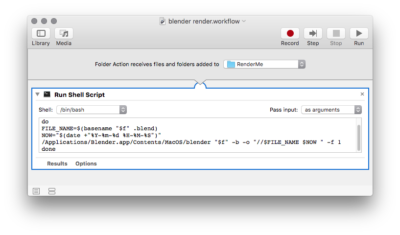
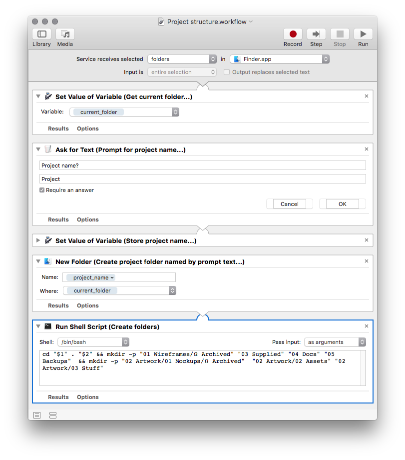

# Automator Workflows

Some handy workflow actions

## Blender Render.workflow

Use a Folder Action + Dropbox to watch and renders added .blend files with a timestamp.

You'll need to add an alias to to Blender in your `~/.bash_profile`

`alias blender='/Applications/Blender.app/Contents/MacOS/blender'`

## Project structure.workflow

Prompts for a project name and creates a folder structure

## Get external ip.workflow

Stick a file in this watched folder to generate a text file with your external IP address

